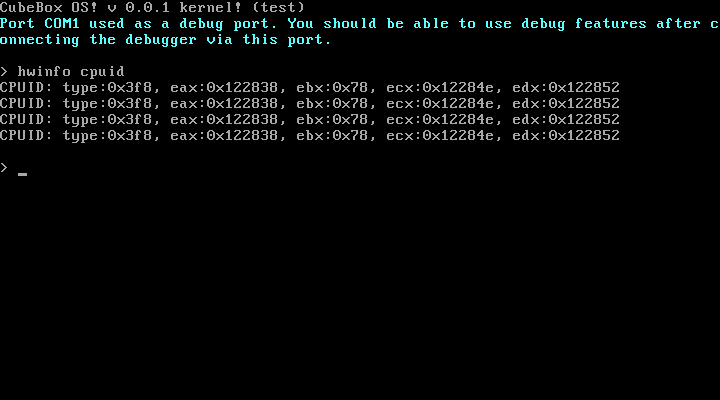

# Cubebox OS

DIY Hobby operating system  

# Build dependencies

* `tar` for initial ramdisk (initrd)
* `xorriso mtools grub grub-common` for image generation
* `gcc build-essentials nasm` for code build (C Compiler, assembler, linker, ...)
* `dosfstools` for floppy generation
